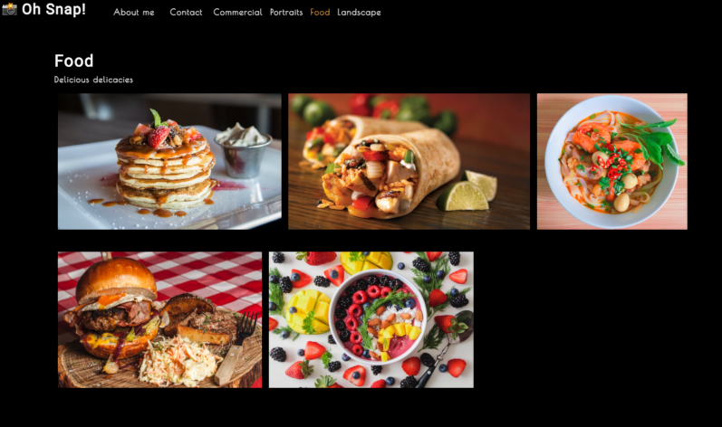

# Demo react-photo-portfolio
 
            

## Description
A photo portfolio rendered in a Single Page Application created with React.  

DEMO Deployment : https://qcent.github.io/react-photo-port/
Screenshot \


## Table of Contents

* [Description](#description)
* [Table of Contents](#table-of-contents)
* [Installation](#installation)
* [Usage](#usage)
  * [Customizing](#customizing-the-portfolio)
  * [Building](#building-your-portfolio)
* [Contributing](#contributing)
* [Tests](#tests)
* [Questions](#questions)
* [License](#license)

## Installation

This project requires that Node.js be installed on the target machine.

Copy the repository files and then run npm install to install all required dependencies.

## Usage

Once all dependencies have been successfully added you can type `npm start` to start the server. It should automatically open a webpage in your default browser.

### Customizing the Portfolio

Some manual editing will be required to display your own photographs. \
1. On line 8 of `src/App.js` you will need to edit the categories array to reflect your desired categories.
2. On line 6 of `src/components/PhotoList/index.js` you will need to edit the photos array to reflect the photos you add to the portfolio.
3. A 'Cover Image' is located at `src/assets/cover/cover-image.jpg` overwrite this file with another of your choice.
4. Photographs must be located at `src/assets/` with thumbnails being located in the `small` directory and full size images in `large`.  Images must be saved with a `.jpg` extension and stored in folders according to their category and named sequentially starting from 0 for each category. The sequential ordering should match the image data ordering from `src/components/PhotoList/index.js` photos array per category. 

*eg.*
```
src/assets/small/cats/0.jpg  // thumbnail
src/assets/large/cats/0.jpg  // full size
src/assets/small/cats/1.jpg  // thumbnail
src/assets/large/cats/1.jpg  // full size

src/assets/small/fish/0.jpg  // thumbnail
src/assets/large/fish/0.jpg  // full size
```
*PhotoList/index.js*
```
  const [photos] = useState([
    {
      name: 'Carp A Deim',
      category: 'fish',
      description: 'My only picture of my favourite carp',
    },
    {
      name: 'Muffins',
      category: 'cats',
      description: 'My 0th picture of my cat category',
    },
    {
      name: 'Rumpleteazer',
      category: 'cats',
      description: 'My 1st picture of my cat category',
    },
   ]);
```

### Building Your Custom Page

After your site is up and running on your local machine you can build the site out as an optimized deployable package by typing `npm run build`. Then you can copy the contents of the `./build` directory to your webserver of choice.

## Contributing

Any contributions are welcome. Just fork the project, test any code you add and request a merge! 

## Tests

To run the suite of included tests just type `npm run test`.

## Questions

[GitHub: Qcent](https://github.com/Qcent)  
dquinn8@cogeco.ca

   
## License

MIT License

Copyright (c) 2022 Dave Quinn

Permission is hereby granted, free of charge, to any person obtaining a copy
of this software and associated documentation files (the "Software"), to deal
in the Software without restriction, including without limitation the rights
to use, copy, modify, merge, publish, distribute, sublicense, and/or sell
copies of the Software, and to permit persons to whom the Software is
furnished to do so, subject to the following conditions:

The above copyright notice and this permission notice shall be included in all
copies or substantial portions of the Software.

THE SOFTWARE IS PROVIDED "AS IS", WITHOUT WARRANTY OF ANY KIND, EXPRESS OR
IMPLIED, INCLUDING BUT NOT LIMITED TO THE WARRANTIES OF MERCHANTABILITY,
FITNESS FOR A PARTICULAR PURPOSE AND NONINFRINGEMENT. IN NO EVENT SHALL THE
AUTHORS OR COPYRIGHT HOLDERS BE LIABLE FOR ANY CLAIM, DAMAGES OR OTHER
LIABILITY, WHETHER IN AN ACTION OF CONTRACT, TORT OR OTHERWISE, ARISING FROM,
OUT OF OR IN CONNECTION WITH THE SOFTWARE OR THE USE OR OTHER DEALINGS IN THE
SOFTWARE.
                 

     
